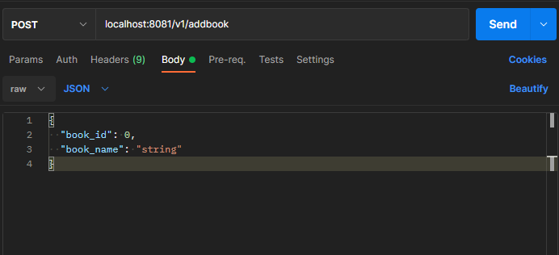

grpc  grpc-gateway 实例
- [GRPC 官网](https://grpc.io/docs/languages/go/basics/)
- [grpc-gateway介绍](https://grpc-ecosystem.github.io/grpc-gateway/)
- [protocol-buffers官方网站](https://developers.google.com/protocol-buffers/docs/proto3)
- [google.api.http](https://github.com/googleapis/googleapis/blob/master/google/api/http.proto#L46)
- [protobuf descriptor.proto](https://github.com/protocolbuffers/protobuf/blob/master/src/google/protobuf/descriptor.proto)

---
The gRPC-Gateway is a plugin of the Google protocol buffers compiler protoc. It reads protobuf service definitions and generates a reverse-proxy server which translates a RESTful HTTP API into gRPC. This server is generated according to the google.api.http annotations in your service definitions.


```go
// 生成gRPC源码的命令
protoc  --go_out=plugins=grpc:.  *.proto
// 执行生成gRPC-Gateway源码的命令
protoc  --grpc-gateway_out=logtostderr=true:.  *.proto
//执行生成swagger文件的命令
protoc --swagger_out=logtostderr=true:.  *.proto
```


