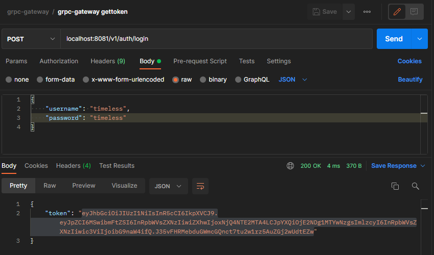
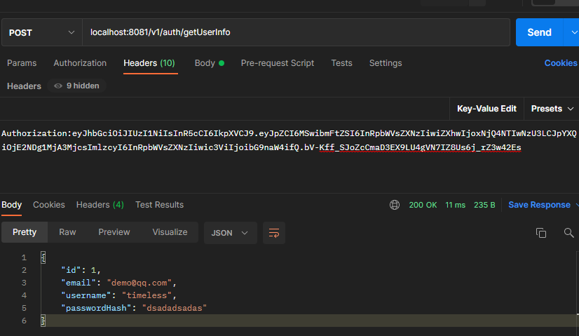

```protobuf
    protoc --go_out = plugins = grpc:auth  *.proto
    protoc --grpc-gateway_out = logtostderr= true:auth/ *.proto
    protoc --swagger_out = logtostderr = true:auth/ *.proto
```

- [在 GoLang 中使用 jwt 进行认证](https://www.cnblogs.com/flipped/p/12973557.html)
- [go-kit 微服务 身份认证 （JWT）](https://www.hwholiday.com/2020/go_kit_v3/)
- [全面了解 jwt 一文足已](https://zhuanlan.zhihu.com/p/70275218)
- [跟我一起学Go系列：Go gRPC 安全认证方式-Token和自定义认证](https://www.cnblogs.com/rickiyang/p/14989375.html)

---
grpc-gateway 登录获取token接口


---
grpc-gateway 带token  获取登录信息


